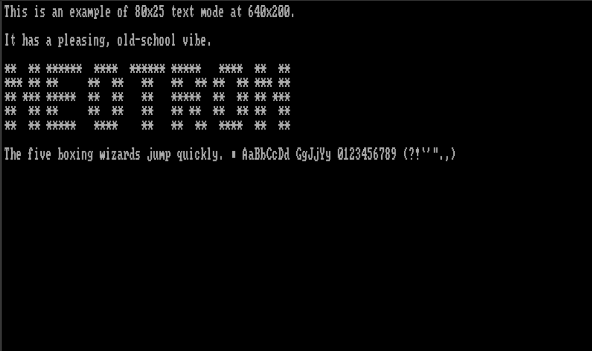
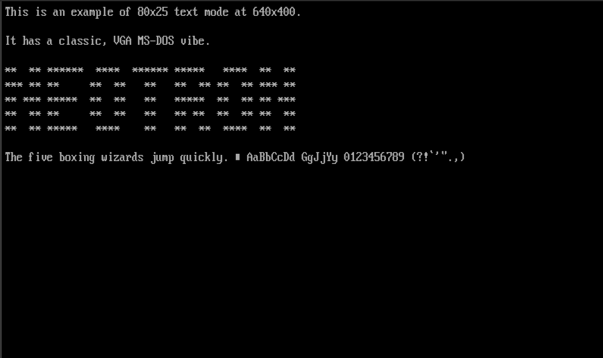
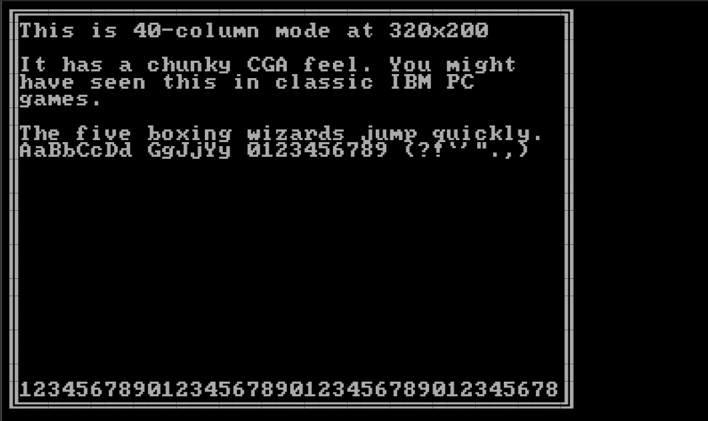

# Video from a System On Chip

Video support from your SoC can vary greatly - from SoCs which basically have no video support but can be 'tricked' into generating a signal that's sort-of VGA compatible, to SoCs which have on-board graphics accelerators that can render multiple semi-transparent planes together.

## Video Modes

First, we should discuss the concept of a _video mode_. This is a collection of parameters which describe the picture that is being generated.

### Timing

In this section, we generally assume that the video is VGA-like - that is, each frame is drawn line-by-line, starting with the top line and moving downwards. A line comprises pixels, which are drawn from left to right. Each pixel has a colour, which can be anywhere between 'on or off' or 'one of 16.8 million colours'. As the pixels are drawn left to right, there will be some extra non-visible 'off-screen' pixels, which are designed to give an old-fashioned cathode-ray tube (CRT) monitor time to move the scanning 'gun' back over to the left hand side of the image ready to draw the next line. In the same fashion, there will be some non-visible 'off-screen' lines which give a CRT's gun time to move back to the top of the frame. Although we almost universally use LCD monitors now, the standards still include these 'blanking periods'.

The monitor is able to find the visible picture within the signal, thanks to the provision of two extra signals - *Horizontal Sync* and *Vertical Sync*. These pulse high (or low) during the middle of the relevant blanking period.

The relevant parameters are:

* Horizontal Visible Pixels - the number of visible pixels on each line
* Horizontal Front Porch - the number of non-visible pixels before the sync pulse
* Horizontal Sync Width - the number of non-visible pixels during the sync pulse
* Horizontal Back Porch - the number of non-visible pixels after the sync pulse
* Horizontal Pixels - the total number of pixels on each line
* Horizontal Scan Rate - the number of lines (visible or non-visible) drawn per second
* Vertical Visible Lines - the number of visible lines in each frame
* Vertical Front Porch - the number of non-visible lines before the sync pulse
* Vertical Sync Width - the number of non-visible lines during the sync pulse
* Vertical Back Porch - the number of non-visible lines after the sync pulse
* Vertical Lines - the total number of lines in each frame
* Frame Rate (or Refresh Rate, or Vertical Scan Rate) - the number of complete frames drawn per second
* Pixel Clock (or Dot Clock) - the number of pixels (visible or non-visible - we'll get to that shortly) produced per second

These terms are related as follows:

```
Horizontal Pixels = Horizontal Visible Pixels + Horizontal Front Porch + Horizontal Sync Width 
+ Horizontal Back Porch
Vertical Lines = Vertical Visible Lines + Vertical Front Porch + Vertical Sync Width 
+ Vertical Back Porch
Horizontal Scan Rate = Pixel Clock / Horizontal Pixels
Frame Rate = Horizontal Scan Rate / Vertical Lines
```

Your monitor will place limits on the values for Frame Rate, Horizontal Scan Rate and Vertical Lines. An analog CRT generally doesn't care about Horizontal Pixels and Pixel Clock - provided the Horizontal Scan Rate is within range - although if you push this beyond the maximum bandwidth of you display (or your cable) the signal starts to get 'smoothed' and the greater definition is lost. A digital display, like an LCD monitor, will sample the analog horizontal signal at fixed intervals and if your source doesn't match perfectly, you may get a fuzzy picture. Generally, the number of horizontal pixels your monitor is looking for is a function of the number of vertical lines, calculated from some look-up table of common video standards.

### Colours

The monitor generally doesn't care about the number of colours each pixel can take, as the pixels are transmitted as analog red, green and blue signals (0.7V peak). However, the SoC will care as the pixels must be stored digital and the more bits per pixel, the more bytes of framebuffer RAM we require!

### Standards

The original IBM standard for the _Video Graphics Array_ included the following video modes:

| H. Vis | V. Vis   | H. Tot | V. Tot | H. Freq    | Frame Rate | Pixel Clock | Used for                                                   |
|:-------|:---------|:-------|:-------|:-----------|:-----------|:------------|:-----------------------------------------------------------|
| 720    | 400      | 900    | 449    | 31.469 kHz | 70 Hz      | 28.322 MHz  | Default 80x25 Text mode                                    |
| 640    | 480      | 800    | 525    | 31.469 kHz | 60 Hz      | 25.175 MHz  | High-res graphics mode                                     |
| 640    | 400      | 800    | 449    | 31.469 kHz | 70 Hz      | 25.175 MHz  | 80x25 text with mixed graphics                             |
| 720    | 350      | 900    | 449    | 31.469 kHz | 70 Hz      | 28.322 MHz  | MDA compatible text mode (720x400 with extra blanking)     |
| 640    | 350      | 800    | 449    | 31.469 kHz | 70 Hz      | 25.175 MHz  | EGA compatible text/graphics (640x400 with extra blanking) |
| 640    | 200 (2x) | 800    | 449    | 31.469 kHz | 70 Hz      | 25.175 MHz  | CGA compatible text/graphics mode                          |
| 320    | 240 (2x) | 400    | 525    | 31.469 kHz | 60 Hz      | 25.175 MHz  | Low-res, high-colour mode                                  |
| 320    | 200 (2x) | 400    | 449    | 31.469 kHz | 70 Hz      | 25.175 MHz  | CGA compatible text/graphics graphics mode                 |

We see from this table that there are only two values for the Vertical Total Lines - 525 for 480-line modes and 449 for 350/400-line modes - corresponding to frame rates of 60 Hz and 70 Hz respectively. There is also the option to increase the pixel clock up from 25.175 MHz to 28.322 MHz, increasing the number of pixels per line from 800 to 900. This, in turn, increases the number of pixels per character on an 80-column text mode display from 8 to 9. Finally, we can simply halve the pixel clock to lower the horizontal resolution, which saves video memory and allows for more colours on screen.

The rates marked _(2x)_ simply have each line drawn twice by the VGA card, in order to keep the Horizontal Frequency at the standard value.

During the 1990s, the resolutions and colour depths supported by video cards increased greatly, and monitors began to support a wider range of horizontal frequencies. These various modes were standardised by the Video Electronics Standards Association (_VESA_), and there are too many to list here. However, some modes of note include:

| H. Visible | V. Visible | H. Total | V. Total | H. Freq  | Frame Rate | Pixel Clock |
|:-----------|:-----------|:---------|:---------|:---------|:-----------|:------------|
| 800        | 600        | 1056     | 628      | 37.9 kHz | 60 Hz      | 40.0 MHz    |
| 1024       | 768        | 1344     | 806      | 48.4 kHz | 60 Hz      | 65.0 MHz    |
| 1280       | 720        | 1664     | 748      | 44.8 kHz | 60 Hz      | 74.5 MHz    |
| 1920       | 1080       | 2576     | 1120     | 67.2 kHz | 60 Hz      | 173.000 MHz |

We don't really think much of 1080p (1920x1080) video these days - often preferring QuadHD (2560x1440) or 4K (3840x2880) for our desktop PC monitors. These tables show, however, that even 1080p is a staggering amount of data for an SoC to generate - especially without any built-in hardware acceleration. The higher resolution modes also consume vast amounts of framebuffer RAM - 1080p in 24-bit True Colour (usually stored as 32-bits per pixel) needs 8100 KiB of RAM, just for a single frame!

## Video Hardware

If we want to generate a VGA compatible signal, we have several options:

### Misuse the wrong peripheral

We can generate pixels on basically any SoC peripheral which has a synchronous (clock-driven) output. Even a basic SPI peripheral can be used, which will generate a 1 bit-per-pixel (black and white) video signal. The Monotron project used three SPI periperals on a TM4C to produce a 3-bit-per-pixel (8 colour) signal, and with a 20 MHz pixel clock to generate a 400x600 image (like 800x600 but with half as many pixels across, and each pixel twice as wide). Various projects for the Espressif ESP32 have used the I²S interface to push out up to 14 pixels per clock cycle (16,384 colour).

The Raspberry Pi Pico takes peripheral abuse even further, by driving a DC-balanced 251.75 MHz TMDS (transition minimised differential signallling) signal out of some standard GPIO pins using a high-speed FIFO, some pre-calculation and some serious over-clocking. This signal is almost exactly like DVI-D video, which thanks to backwards compatibility, can be sent over an HDMI cable to any HDMI or DVI-D compatible display.

### Use a TFT-LCD Controller Peripheral

Many SoCs include hardware for driving an RGB TFT LCD panel. The good news is that these RGB panels are designed to look just like a VGA monitor (but with digital bits for each pixel rather than three analog signals), and these controllers can often be programmed to generate VGA compatible signals.

Look for the LTDC (LCD TFT Display Controller) on the STM32 line, for example.

### Use an MIPI DSI Controller Peripheral

MIPI DSI (Mobile Industry Processor Interface Display Serial Interface) is a standard for pushing pixels into a display using a high-speed serial interface. This reduces pin-count and electronic magnetic interference, compared to waggling the 26 individual signal lines required to send 24-bit-per-pixel digital video. DSI is often sent over flexible ribbon cable, you can see a DSI port on most Raspberry Pi boards.

You can get chips which will take in a DSI signal and output HDMI, such as the [Analog Devices ADV7533](https://www.analog.com/en/products/adv7533.html) but implementing an proper 'HDMI' output will require licensing and for this reason the chips are often only available under NDA.

### Use an off-chip video controller

If there really is nothing suitable, you can always get a second SoC or dedicated video controller to drive your display. Such chips are popular for driving LCD panels (e.g. the ILI9341 or the ST7920) but can sometimes be configured to generate VGA compatible signals.

## Text vs Graphics

Neotron's video support is based broadly on that of the IBM PC _Video Graphics Array_. In the previous section, we discussed the physical attributes of the analog video signal generated by a _VGA_ card. What we didn't cover, is how we generate that signal based on the contents of Video RAM (VRAM).

Broadly, the IBM PC has two kinds of video modes - text mode and graphics mode. Text mode is what MS-DOS would boot up in, and Graphics mode (also known in Linux as _framebuffer mode_) is what Windows 3.1 or a game like Doom would switch to. Whilst some systems (in particular 1990s RISC workstations, and modern ARM systems) have no concept of a 'text mode' and instead draw text to a graphical framebuffer, we retain the two distinct types of mode in Neotron in order to save on VRAM.

### Text Modes

Text modes divide the screen into a rectangular grid of _cells_. Each _cell_ contains a _character_ and a set of _attributes_ (such as the _foreground_ and _background_ colour for that cel). Each _character_ is represented by a image, known as a _glyph_. All of the _glyphs_ in a given _font_ have the same width and height in pixels, and they each use precisely two colours - _foreground_ and _background_. The specific value of _foreground_ and _background_ can be set for each _cell_ on the screen, meaning that each _cell_ takes up two bytes: one for the _character_, and one for the attributes. As the raster beam moves across the display, the video card will fetch the _character_ for that _cell_ from VRAM, then load the corresponding _glyph_ from the _font_ (which may be in VRAM, or it may be in the card's ROM). The appropriate horizontal slice is taken from the _glyph_, which is then converted to a sequence of coloured pixels by applying the _foreground_ and _background_ colour for that _cell_. These coloured pixels are then transmitted to the monitor in real-time.

Typically (and certainly in VGA text modes), each _character_ is an 8-bit value, and so there can only be 256 _glyphs_ in a _font_. Merging multiple _characters_ into a single _glyph_ (as you might do in Unicode with a `U+0041 LATIN CAPITAL LETTER A` followed by a `U+02CA MODIFIER LETTER ACUTE ACCENT` to produce an `Á`) is generally not supported, although a swap for a single _character_ could be performed by the OS when the string was first written to the VRAM if the current font had a suitable _glyph_ available.

The two main text mode resolutions for VGA are 80 columns by 25 rows, and 80 columns by 50 rows (plus some others that are much less common). The video output resolutions these correspond to depend on the _glyph_ size, as follows:

| Columns x Rows | Glyph Width | Glyph Height | Horizontal Pixels | Vertical Pixels | Standard      |
|:---------------|:------------|:-------------|:------------------|:----------------|:--------------|
| 80 x 25        | 9           | 14           | 720               | 350             | MDA, Hercules |
| 40 x 25        | 8           | 8            | 320               | 200             | CGA, EGA      |
| 80 x 25        | 8           | 8            | 640               | 200             | CGA, EGA      |
| 80 x 25        | 8           | 14           | 640               | 350             | EGA           |
| 80 x 43        | 8           | 8            | 640               | 350             | EGA           |
| 80 x 25        | 9           | 16           | 720               | 400             | VGA           |
| 80 x 50        | 9           | 8            | 720               | 400             | VGA           |
| 80 x 30        | 8           | 16           | 640               | 480             | VGA           |
| 80 x 60        | 8           | 8            | 640               | 480             | VGA           |

Because a Neotron system might support other video resolutions (e.g. the native 400x300 of a Neotron 32), there is no prescriptive list of Neotron text modes. Instead, there is a BIOS API to query which modes are supported, and the width in columns and height in rows of each mode. It is assumed that each mode supports 16 foreground colours and 8 background colours, just like VGA, and that memory is arranged in a linear array of 16-bit values, where the first (lower) 8-bits identify the character and the second (higher) 8-bits identify the foreground and background colour.

```
+-----+---+---+---+---+---+---+---+---+---+---+---+---+---+---+---+
|             Attribute           |           Character           |
+-----+---+---+---+---+---+---+---+---+---+---+---+---+---+---+---+
|  7  | 6 | 5 | 4 | 3 | 2 | 1 | 0 | 7 | 6 | 5 | 4 | 3 | 2 | 1 | 0 |
+-----+---+---+---+---+---+---+---+---+---+---+---+---+---+---+---+
|Blink| Backgr'nd |  Foreground   |           Code Point          |
+-----+---+---+---+---+---+---+---+---+---+---+---+---+---+---+---+
```

(Diagram courtesy <https://en.wikipedia.org/wiki/VGA_text_mode>)

The `Blink` bit causes the text to alternate between being drawn normally, and being drawn entirely in the background colour (thus rendering it invisible).

Where the graphics are drawn by an off-chip GPU, the Neotron BIOS will need to arrange for the on-chip VRAM to be copied to the off-chip GPU during the vertical blanking interval of each frame. A text mode with 80 x 50 characters will require 4000 bytes of VRAM, which at 70 Hz needs a link of just over 41 Mbit/sec in order for the copy to complete during the blanking interval. If you are prepared to 'chase the beam' you can run a little slower. 80x25 video modes will require half that, and using run-length encoding will likely reduce it further (especially as consecutive cells are usually the same colour).

## Support in Neotron

To keep things simple, Neotron has an 8-bit video mode value, four components. This means that an application can simply ask for 'Mode 0x25' instead of having to scan through a list of obscure modes to find out which one is closest.

```
+---------+-----------+----------+-----------+
| Vert 2x |   Timing  | Horiz 2x |   Format  |
+---------+-----------+----------+---+---+---+
|    7    | 6 | 5 | 4 |    3     | 2 | 1 | 0 |
+---------+-----------+----------+---+---+---+
```

If `Vert 2x` is set, each output scan-line is drawn twice, which halves the number of rows in memory (of text or pixels).

If `Horiz 2x` is set, each pixel is drawn twice, which halves the number of columns in memory (of text or pixels).

The Timing table is:

| Mode | Visible   | Total      | Pixel Clock | Horizontal Scan Rate | Frame Rate |
|:-----|:----------|:-----------|:------------|:---------------------|:-----------|
| 0    | 640 x 480 | 800 x 525  | 25.175 MHz  | 31.5 kHz             | 60 Hz      |
| 1    | 640 x 400 | 800 x 449  | 25.175 MHz  | 31.5 kHz             | 70 Hz      |
| 2    | 800 x 600 | 1056 x 628 | 40.000 MHz  | 37.9 kHz             | 60 Hz      |
| 4..7 | TBD       | TBD        | TBD         | TBD                  | TBD        |


The Format table is:

| Mode | Text/Graphics | Font Size | Colour Depth  |
|:-----|:--------------|:----------|:--------------|
| 0    | Text          | 8 x 16    | 16/8 Indexed  |
| 1    | Text          | 8 x 8     | 16/8 Indexed  |
| 2    | Graphics      | N/A       | 32/24-bpp     |
| 3    | Graphics      | N/A       | 16-bpp        |
| 4    | Graphics      | N/A       | 8-bpp Indexed |
| 5    | Graphics      | N/A       | 4-bpp Indexed |
| 6    | Graphics      | N/A       | 2-bpp Indexed |
| 7    | Graphics      | N/A       | 1-bpp Indexed |

The values marked `Indexed` have their colours translated with a 256-entry colour palette that converts from the indexed value up to a true-colour 24-bit value. These true-colour values may be truncated when output by the video card's DAC. The `32/24-bpp` entry stores 24-bit colours in a 32-bit memory location, for efficiency of access. We assume no Neotron system will ever have better than 24-bit video output!

### Example Modes

* 0x05: 640 x 480 graphics @ 60 Hz, with 16 colours (4-bpp)
* 0x10: 80 x 25 text mode, with 400 lines at 70 Hz
* 0x01: 80 x 60 text mode, with 480 lines at 60 Hz
* 0x9C: 320 x 200 graphics @ 70 Hz, with 256 colours (8-bpp)

These example screen-shots were generated using https://int10h.org/oldschool-pc-fonts/fontlist/:

80x25 text with an 8x8 font (640x200), like an IBM PC-compatible with CGA:



80x25 text with an 8x16 font (640x400), like an IBM PC-compatible with MCGA (or VGA in 8x16 mode, instead of the usual 9x16):



40x25 text with an 8x8 font (320x200), like an IBM PC-compatible with CGA in multi-colour mode:



### Complete Mode List

For completeness, here is every one of the currently defined video modes. More will be added as further *Timing Mode* values are defined.

| Mode | Timing         | V2x | H2x | Description         | VRAM (bytes) |
|:-----|:---------------|:----|:----|:--------------------|-------------:|
| 0x00 | 0 (640x480@60) | 0   | 0   | 80x30 text          |        4,800 |
| 0x01 | 0 (640x480@60) | 0   | 0   | 80x60 text          |        9,600 |
| 0x02 | 0 (640x480@60) | 0   | 0   | 640x480 True-colour |    1,228,800 |
| 0x03 | 0 (640x480@60) | 0   | 0   | 640x480 High-colour |      614,400 |
| 0x04 | 0 (640x480@60) | 0   | 0   | 640x480 256-colour  |      307,200 |
| 0x05 | 0 (640x480@60) | 0   | 0   | 640x480 16-colour   |      153,600 |
| 0x06 | 0 (640x480@60) | 0   | 0   | 640x480 4-colour    |       76,800 |
| 0x07 | 0 (640x480@60) | 0   | 0   | 640x480 2-colour    |       38,400 |
| 0x10 | 1 (640x400@70) | 0   | 0   | 80x25 text          |        4,000 |
| 0x11 | 1 (640x400@70) | 0   | 0   | 80x50 text          |        8,000 |
| 0x12 | 1 (640x400@70) | 0   | 0   | 640x400 True-colour |    1,024,000 |
| 0x13 | 1 (640x400@70) | 0   | 0   | 640x400 High-colour |      512,000 |
| 0x14 | 1 (640x400@70) | 0   | 0   | 640x400 256-colour  |      256,000 |
| 0x15 | 1 (640x400@70) | 0   | 0   | 640x400 16-colour   |      128,000 |
| 0x16 | 1 (640x400@70) | 0   | 0   | 640x400 4-colour    |       64.000 |
| 0x17 | 1 (640x400@70) | 0   | 0   | 640x400 2-colour    |       32,000 |
| 0x20 | 2 (800x600@60) | 0   | 0   | 100x37 text         |        7,400 |
| 0x21 | 2 (800x600@60) | 0   | 0   | 100x75 text         |       14,800 |
| 0x22 | 2 (800x600@60) | 0   | 0   | 800x600 True-colour |    1,920,000 |
| 0x23 | 2 (800x600@60) | 0   | 0   | 800x600 High-colour |      960,000 |
| 0x24 | 2 (800x600@60) | 0   | 0   | 800x600 256-colour  |      480,000 |
| 0x25 | 2 (800x600@60) | 0   | 0   | 800x600 16-colour   |      240,000 |
| 0x26 | 2 (800x600@60) | 0   | 0   | 800x600 4-colour    |      120,000 |
| 0x27 | 2 (800x600@60) | 0   | 0   | 800x600 2-colour    |       60,000 |
| 0x80 | 0 (640x480@60) | 1   | 0   | 80x15 text          |        2,400 |
| 0x81 | 0 (640x480@60) | 1   | 0   | 80x30 text          |        4,800 |
| 0x82 | 0 (640x480@60) | 1   | 0   | 640x240 True-colour |      614,400 |
| 0x83 | 0 (640x480@60) | 1   | 0   | 640x240 High-colour |      307,200 |
| 0x84 | 0 (640x480@60) | 1   | 0   | 640x240 256-colour  |      153,600 |
| 0x85 | 0 (640x480@60) | 1   | 0   | 640x240 16-colour   |       76,800 |
| 0x86 | 0 (640x480@60) | 1   | 0   | 640x240 4-colour    |       38,400 |
| 0x87 | 0 (640x480@60) | 1   | 0   | 640x240 2-colour    |       19,200 |
| 0x90 | 1 (640x400@70) | 1   | 0   | 80x12 text          |        1,920 |
| 0x91 | 1 (640x400@70) | 1   | 0   | 80x25 text          |        4,000 |
| 0x92 | 1 (640x400@70) | 1   | 0   | 640x200 True-colour |      512,000 |
| 0x93 | 1 (640x400@70) | 1   | 0   | 640x200 High-colour |      256,000 |
| 0x94 | 1 (640x400@70) | 1   | 0   | 640x200 256-colour  |      128,000 |
| 0x95 | 1 (640x400@70) | 1   | 0   | 640x200 16-colour   |       64.000 |
| 0x96 | 1 (640x400@70) | 1   | 0   | 640x200 4-colour    |       32,000 |
| 0x97 | 1 (640x400@70) | 1   | 0   | 640x200 2-colour    |       16,000 |
| 0xA0 | 2 (800x600@60) | 1   | 0   | 100x18 text         |        3,700 |
| 0xA1 | 2 (800x600@60) | 1   | 0   | 100x37 text         |        7,400 |
| 0xA2 | 2 (800x600@60) | 1   | 0   | 800x300 True-colour |      960,000 |
| 0xA3 | 2 (800x600@60) | 1   | 0   | 800x300 High-colour |      480,000 |
| 0xA4 | 2 (800x600@60) | 1   | 0   | 800x300 256-colour  |      240,000 |
| 0xA5 | 2 (800x600@60) | 1   | 0   | 800x300 16-colour   |      120,000 |
| 0xA6 | 2 (800x600@60) | 1   | 0   | 800x300 4-colour    |       60,000 |
| 0xA7 | 2 (800x600@60) | 1   | 0   | 800x300 2-colour    |       30,000 |
| 0x08 | 0 (640x480@60) | 0   | 1   | 40x30 text          |        2,400 |
| 0x09 | 0 (640x480@60) | 0   | 1   | 40x60 text          |        4,800 |
| 0x0A | 0 (640x480@60) | 0   | 1   | 320x480 True-colour |      614,400 |
| 0x0B | 0 (640x480@60) | 0   | 1   | 320x480 High-colour |      307,200 |
| 0x0C | 0 (640x480@60) | 0   | 1   | 320x480 256-colour  |      153,600 |
| 0x0D | 0 (640x480@60) | 0   | 1   | 320x480 16-colour   |       76,800 |
| 0x0E | 0 (640x480@60) | 0   | 1   | 320x480 4-colour    |       38,400 |
| 0x0F | 0 (640x480@60) | 0   | 1   | 320x480 2-colour    |       19,200 |
| 0x18 | 1 (640x400@70) | 0   | 1   | 40x25 text          |        2,000 |
| 0x19 | 1 (640x400@70) | 0   | 1   | 40x50 text          |        4,000 |
| 0x1A | 1 (640x400@70) | 0   | 1   | 320x400 True-colour |      512,000 |
| 0x1B | 1 (640x400@70) | 0   | 1   | 320x400 High-colour |      256,000 |
| 0x1C | 1 (640x400@70) | 0   | 1   | 320x400 256-colour  |      128,000 |
| 0x1D | 1 (640x400@70) | 0   | 1   | 320x400 16-colour   |       64.000 |
| 0x1E | 1 (640x400@70) | 0   | 1   | 320x400 4-colour    |       32,000 |
| 0x1F | 1 (640x400@70) | 0   | 1   | 320x400 2-colour    |       16,000 |
| 0x28 | 2 (800x600@60) | 0   | 1   | 50x37 text          |        3,700 |
| 0x29 | 2 (800x600@60) | 0   | 1   | 50x75 text          |        7,400 |
| 0x2A | 2 (800x600@60) | 0   | 1   | 400x600 True-colour |      960,000 |
| 0x2B | 2 (800x600@60) | 0   | 1   | 400x600 High-colour |      480,000 |
| 0x2C | 2 (800x600@60) | 0   | 1   | 400x600 256-colour  |      240,000 |
| 0x2D | 2 (800x600@60) | 0   | 1   | 400x600 16-colour   |      120,000 |
| 0x2E | 2 (800x600@60) | 0   | 1   | 400x600 4-colour    |       60,000 |
| 0x2F | 2 (800x600@60) | 0   | 1   | 400x600 2-colour    |       30,000 |
| 0x88 | 0 (640x480@60) | 1   | 1   | 40x15 text          |        1,200 |
| 0x89 | 0 (640x480@60) | 1   | 1   | 40x30 text          |        2,400 |
| 0x8A | 0 (640x480@60) | 1   | 1   | 320x240 True-colour |      307,200 |
| 0x8B | 0 (640x480@60) | 1   | 1   | 320x240 High-colour |      153,600 |
| 0x8C | 0 (640x480@60) | 1   | 1   | 320x240 256-colour  |       76,800 |
| 0x8D | 0 (640x480@60) | 1   | 1   | 320x240 16-colour   |       38,400 |
| 0x8E | 0 (640x480@60) | 1   | 1   | 320x240 4-colour    |       19,200 |
| 0x8F | 0 (640x480@60) | 1   | 1   | 320x240 2-colour    |        9,600 |
| 0x98 | 1 (640x400@70) | 1   | 1   | 40x12 text          |          960 |
| 0x99 | 1 (640x400@70) | 1   | 1   | 40x25 text          |        2,000 |
| 0x9A | 1 (640x400@70) | 1   | 1   | 320x200 True-colour |      256,000 |
| 0x9B | 1 (640x400@70) | 1   | 1   | 320x200 High-colour |      128,000 |
| 0x9C | 1 (640x400@70) | 1   | 1   | 320x200 256-colour  |       64.000 |
| 0x9D | 1 (640x400@70) | 1   | 1   | 320x200 16-colour   |       32,000 |
| 0x9E | 1 (640x400@70) | 1   | 1   | 320x200 4-colour    |       16,000 |
| 0x9F | 1 (640x400@70) | 1   | 1   | 320x200 2-colour    |       16,000 |
| 0xA8 | 2 (800x600@60) | 1   | 1   | 50x18 text          |        1,800 |
| 0xA9 | 2 (800x600@60) | 1   | 1   | 50x37 text          |        3,700 |
| 0xAA | 2 (800x600@60) | 1   | 1   | 400x300 True-colour |      480,000 |
| 0xAB | 2 (800x600@60) | 1   | 1   | 400x300 High-colour |      240,000 |
| 0xAC | 2 (800x600@60) | 1   | 1   | 400x300 256-colour  |      120,000 |
| 0xAD | 2 (800x600@60) | 1   | 1   | 400x300 16-colour   |       60,000 |
| 0xAE | 2 (800x600@60) | 1   | 1   | 400x300 4-colour    |       30,000 |
| 0xAF | 2 (800x600@60) | 1   | 1   | 400x300 2-colour    |       15,000 |