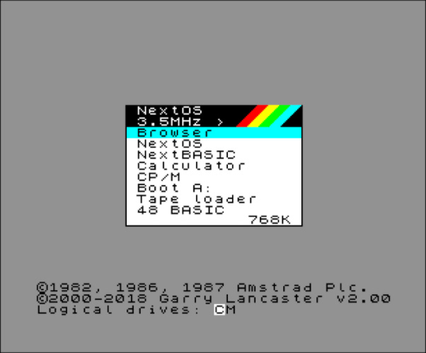

# The Neotron Menu Shell

In some cases, the Neotron Command Shell is a little *too* bare-bones. Perhaps the primary use of the Neotron is to play some games, or perhaps you want to browse the SD quickly using a GUI. For these situations, you can set your default shell to be the Menu Shell.

The Menu Shell is inspired by the boot-up menu on NextOS for the [Spectrum Next].

The Neotron Menu is displayed in text-mode (nominally 48x36) and offers a series of options the user can scroll between using the arrow keys on a PS/2 keyboard or a Joystick in Port 1. These options all correspond to an item in the Neotron Command Shell, and so there is no extra functionality offered by the Neotron Menu Shell - it just makes existing functionality easier to access. Note that the final item on the list exits the Neotron Menu Shell and replaces it as the current shell with the Neotron Command Shell.

* File Manager - allows the user to browse the list of volumes, and the files and directories on those volumes. It supports the usual Create/Move/Rename/Copy/Load/Delete operations.
* Tiny BASIC - loads [Tiny BASIC] compiled as Neotron Application.
* 6502 BASIC - loads a 6502 Emulator, which then runs Enhanced BASIC.
* Test Video - runs through the various graphical/text video modes.
* Test Audio - runs through the various tones that can be generated.
* Test Parallel Port - displays the printer status, and optionally sends some ASCII text to the parallel printer port.
* Configure Date/Time - displays the current RTC status and allows the date/time to be set.
* Configure Keyboard - allows the keyboard to be tested, and the layout selected 
* MIDI Keyboard - allows you to use the Neotron as a synthesiser, by connecting a MIDI Keyboard to the MIDI In port.
* Configure WiFi - allows you to browse the WiFi networks, and join a particular network.
* Serial Terminal - allows you to exchange characters with any serial port in the system, including the RS-232 port and the WiFi interface.

[Spectrum Next]: https://www.specnext.com/
[Tiny BASIC]: https://en.wikipedia.org/wiki/Tiny_BASIC
[Enhanced BASIC]: http://retro.hansotten.nl/6502-sbc/lee-davison-web-site/enhanced-6502-basic/